# Flan-T5: One Model for ALL Tasks

> 论文：Scaling Instruction-Finetuned Language Models
> 
> 论文地址：https://arxiv.org/abs/2210.11416
> 
> 公开模型：https://huggingface.co/google/flan-t5-xxl
>
> 作者：杨夕
>
> NLP论文学习笔记 地址：https://github.com/km1994/nlp_paper_study
> 
> 推荐系统论文学习笔记 地址： https://github.com/km1994/RS_paper_study
> 
> GCN论文学习笔记 地址  https://github.com/km1994/GCN_study
> 
> NLP 百面百搭地址：https://github.com/km1994/NLP-Interview-Notes
> 
> 推荐系统 百面百搭地址：https://github.com/km1994/RES-Interview-Notes
> 
> 推广搜 军火库地址： https://github.com/km1994/recommendation_advertisement_search

## 一、动机

目前，NLP任务百花齐放，各式各样，学习起来不知所措，特别是用于工程部署，一个任务需要训练一个模型，这不仅导致 开发者后期很难维护，同时需要硬件资源变得非常庞大。

那么，是否有这种方案：通过在超大规模的任务上进行微调，让语言模型具备了极强的泛化性能，做到单个模型就可以在1800多个NLP任务上都能有很好的表现呢？即 实现 **One model for ALL tasks**？

近日，来自谷歌的研究者分析了多种指令微调方法，包括扩展对指令微调的影响。实验表明，指令微调确实可以根据任务数量和模型大小实现良好的扩展，最大到 5400 亿参数的模型都能明显受益，未来的研究应该进一步扩大任务的数量和模型的大小。此外，该研究还分析了微调对模型执行推理能力的影响，结果都是很吸引人的。

由此产生的 Flan-T5 对 1800 余种语言任务进行了指令微调，明显提高了提示和多步推理能力，30 亿参数跑基准就能超过 GPT-3 的 1750 亿参数。

## 二、什么是 Flan-T5

这里的Flan 指的是（Instruction finetuning ），即"基于指令的微调"；T5是2019年Google发布的一个语言模型了。注意这里的语言模型可以进行任意的替换（需要有Decoder部分，所以不包括BERT这类纯Encoder语言模型），论文的核心贡献是提出一套多任务的微调方案（Flan），来极大提升语言模型的泛化性。

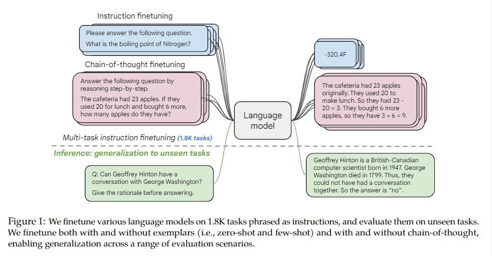

> 例如下面文章中的例子，模型训练好之后，可直接让模型做问答
> 
> 模型输入是："Geoffrey Hinton和George Washington这两个人有没有交谈过？在回答之前想一想原因。“
> 
> 模型返回是：Geoffrey Hinton是一个计算机科学家，出生在1947年；而George Washington在1799年去世。所以这两个不可能有过交谈。所以答案时“没有”。

## 三、 Flan-T5 实现机制

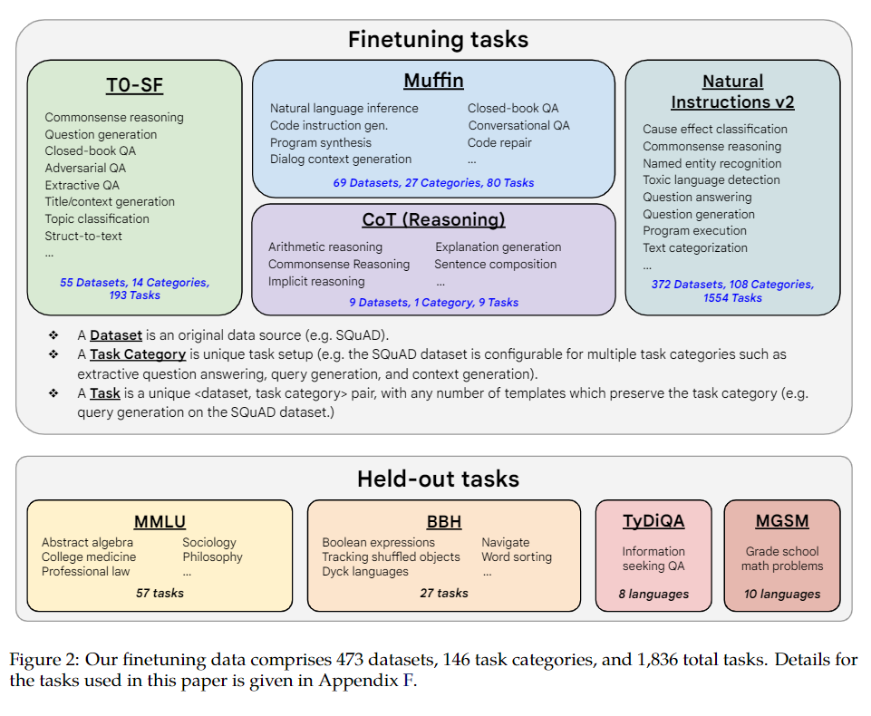
> 1800+微调任务

1. step 1: 任务收集：收集一系列监督的数据，这里一个任务可以被定义成<数据集，任务类型的形式>，比如“基于SQuAD数据集的问题生成任务”。需要注意的是这里有9个任务是需要进行推理的任务，即Chain-of-thought （CoT）任务。
2. step 2: 形式改写：因为需要用单个语言模型来完成超过1800+种不同的任务，所以需要将任务都转换成相同的“输入格式”喂给模型训练，同时这些任务的输出也需要是统一的“输出格式”。

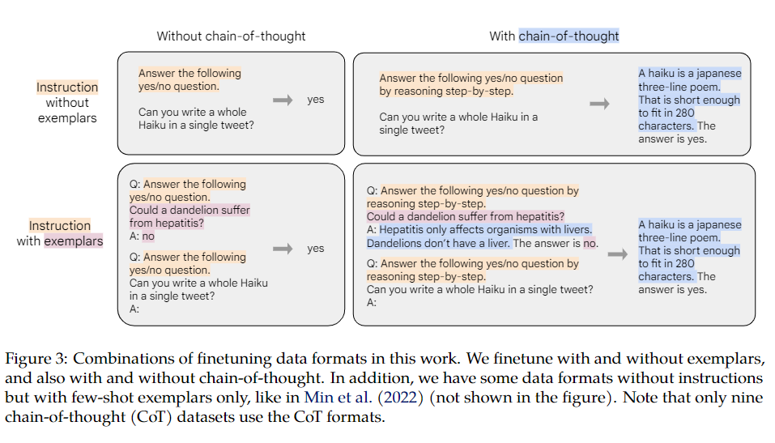
> 根据 “是否需要进行推理 （CoT）” 以及 “是否需要提供示例（Few-shot）”

可将输入输出划分成四种类型：

- chain-of-thought : ❎ and few-shot: ❎ （图中左上）
  - 输入：指令 + 问题
  - 输出：答案
- chain-of-thought : ✅ and few-shot: ❎ （图中右上）
  - 输入：指令 + CoT引导（by reasoning step by step） + 问题
  - 输出：理由 + 答案
- chain-of-thought: ❎ and few-shot: ✅ （图中左下）
  - 输入：指令 + 示例问题 + 示例问题回答 + 指令 + 问题
  - 输出：答案
- chain-of-thought: ✅ and few-shot: ✅（图中右下）
  - 输入：指令 + CoT引导 + 示例问题 + 示例问题理由 + 示例问题回答 + 指令 + CoT引导 + 问题
  - 输出：理由 + 答案

3. 训练过程：采用恒定的学习率以及Adafactor优化器进行训练；同时会将多个训练样本“打包”成一个训练样本，这些训练样本直接会通过一个特殊的“结束token”进行分割。训练时候在每个指定的步数会在“保留任务”上进行模型评估，保存最佳的checkpoint。

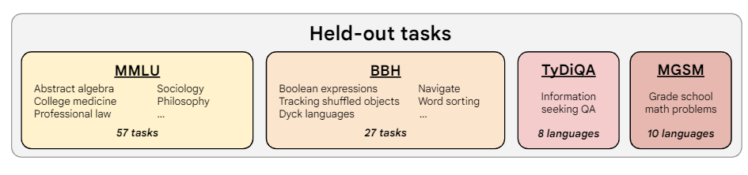

尽管微调的任务数量很多，但是相比于语言模型本身的预训练过程，计算量小了非常多，只有0.2%。所以通过这个方案，大公司训练好的语言模型可以被再次有效的利用，我们只需要做好“微调”即可，不用重复耗费大量计算资源再去训一个语言模型。

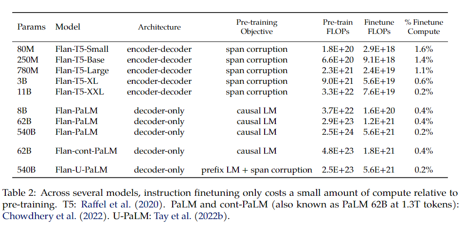

## 四、 Flan-T5 总结

1. 微调很重要

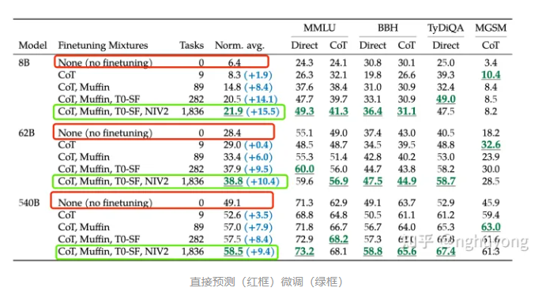

与不微调相比，通过基于指令的微调（flan）可以大幅度提高语言模型的效果

2. 模型越大效果越好

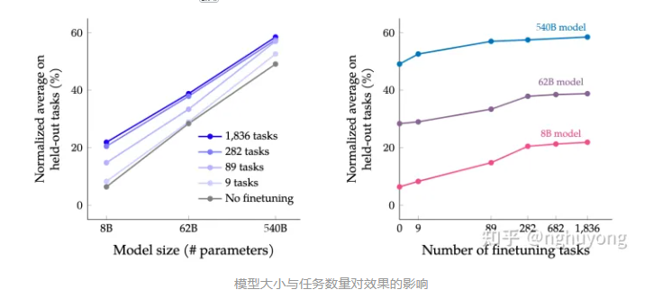

3. 任务越多效果越好

伴随任务数量的增加(上图右)，模型的性能也会跟着增加，但是当任务数量超过282个之后，提升就不是很明显了。因为继续增加新的任务，尤其任务形式跟之前一样，不会给模型带来新的知识；多任务微调的本质是模型能够更好的把从预训练学到的知识进行表达，超过一定任务之后，继续新增相似的任务，知识的表达能力不会继续有很大的收益。进一步统计全部微调数据集的token数，发现只占到了预训练数据token数的0.2%，这表明还是有很多的知识没有在微调阶段重新被激发。

4. 混杂CoT相关的任务很重要

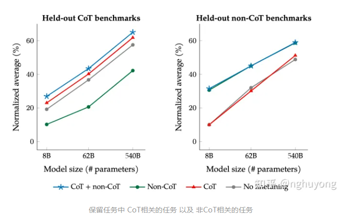

尽管在1800多个任务中只有9个需要推理再给出回答的任务（CoT任务），但是混杂了这9个任务之后对整个模型的提升很大。在针对CoT相关任务的预测上，如果在微调中混淆CoT任务能带来明显的提升（左图中蓝色和绿色线）；在针对非CoT相关任务的预测上，如果在微调中混淆了CoT任务也不会对模型带来伤害（右图中蓝色和绿色线）。

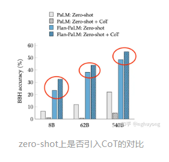

另外对于Zero-Shot的任务，微调中混淆CoT任务也能有明显的提升。

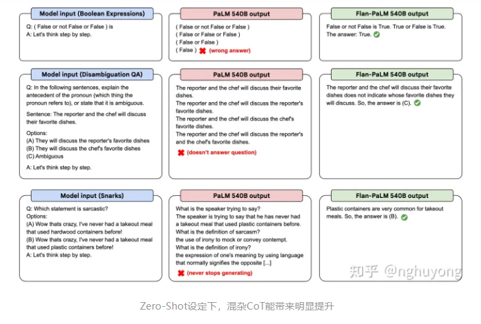

5. 整合起来

最终在多个不同尺寸的模型上进行实验，都可以获得一致性的结论：引入Flan微调方案，可以很好提高语言模型在超大规模任务上的整体效果。

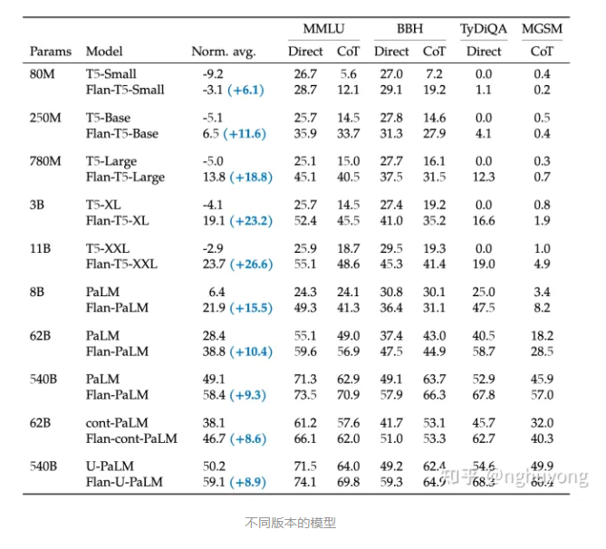

总结一下，这篇工作提出了Flan的微调框架，核心有四点：统一的输入输出格式（4种类型），引入chain-of-thought，大幅提高任务数量，大幅提高模型体积；实现了用一个模型来解决超过1800种几乎全部的NLP任务，通过较低的成本，极大发掘了现有语言模型的泛化性能，让大家看到了通用模型的希望，即One Model for ALL Tasks。

## 参考

1. [Flan-T5: One Model for ALL Tasks (作者：nghuyong)](https://zhuanlan.zhihu.com/p/580468546)
2. [谷歌Flan-T5诞生！1800种语言任务超大规模微调](https://blog.csdn.net/xixiaoyaoww/article/details/127524968)
3. [Flan-PaLM&T5](https://mdnice.com/writing/522c525b7e214ccba7deba664a20dc37)