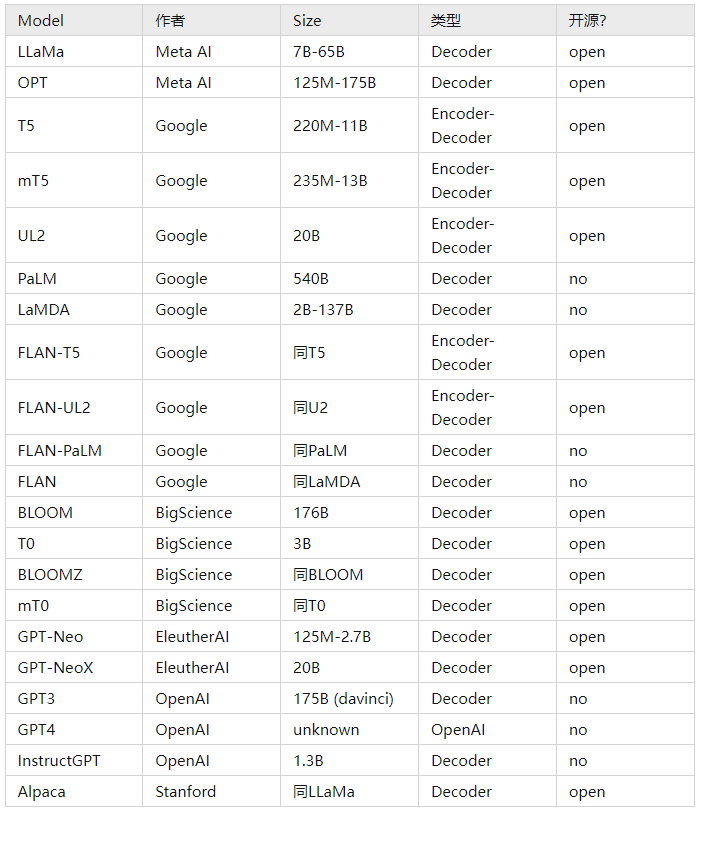

# LLMs

## 一、模型一览

## LLaMA

- 论文名称：LLaMA: Open and Efficient Foundation Language Models
- 作者：Meta/Facebook AI
- 论文地址：https://arxiv.org/pdf/2302.13971v1.pdf
- 论文github：https://github.com/facebookresearch/llama
- 时间：2023.02.27
- 论文介绍：介绍了一系列公开发布的语言模型，这些模型与最先进的基础模型具有竞争力。最值得注意的是，LLaMA-13B比GPT-3小10倍以上，并且LLaMA-65B与Chinchilla-70B和PaLM-540B具有竞争力。与之前的研究不同，通过仅在公开可用数据上进行训练，而无需使用专有数据集，就可以实现最先进的性能。向研究界发布这些模型将加速大型语言模型的开发，并有助于提高其鲁棒性，缓解毒性和偏见等已知问题。此外，像Chung等人（2022）一样观察到，根据指令微调这些模型会产生有希望的结果，计划在未来的工作中进一步研究这一点。最后，计划在未来发布在更大的预训练语料库上训练的更大模型，因为在扩展时看到了性能的不断提高。

## OPT

- 论文名称：OPT: Open Pre-trained Transformer Language Models
- 作者：Meta/Facebook AI
- 论文地址：https://arxiv.org/pdf/2205.01068.pdf
- 论文github：https://github.com/facebookresearch/metaseq
- 时间：
- 论文介绍：介绍了 OPT，这是一个自回归语言模型的集合，参数大小从 125M 到 175B 不等。 我们的目标是复制 GPT-3 类模型的性能和大小，同时在数据管理和训练效率方面应用最新的最佳实践。 我们描述了训练细节，评估了许多 NLP 和对话设置中的表现，并描述了关于偏见、毒性和仇恨言论的行为。 我们还描述了模型的许多其他限制，并讨论了负责任地发布模型的一系列广泛考虑因素。 我们相信整个 AI 社区将从共同努力为负责任的 LLM 制定指南中受益，我们希望广泛使用这些类型的模型将增加定义此类技术的伦理考虑的声音的多样性。
- 论文结论：
  - 结构：基于Transformers的模型结构，进行堆叠；
  - 模型大小：从125M 到 175B，大致匹配 GPT-3 类模型的性能和大小；
  - 训练语料：主要包含英语文本，存在少量非英语数据；
  - 数据量：GPT-2 BPE tokenizer，大约 180B 个tokens;
  - 训练效率：仅为GPT-3训练所需计算量的1/7；
  - 性能评估avg. accuracy：
    - Zero-shot: 与GPT-3 模型的表现相似，有些任务表现出高度不稳定
    - Multishot-shot: 大多数任务的性能与 GPT-3 大致相似，一些任务表现出不稳定的行为
  - 能力：诗歌生成，对话生成，few-shot翻译， 论文写作，算术，Python 编程。

## T5

- 论文名称：T5: Exploring the Limits of Transfer Learning with a Unified Text-to-Text Transformer
- 作者：Google
- 论文地址：https://arxiv.org/pdf/1910.10683.pdf
- 论文github：https://github.com/google-research/text-to-text-transfer-transformer
- 时间：
- 论文介绍：介引入一个统一的自然语言处理迁移框架，该框架将所有的自然言语处理任务统一为text-to-text形式。本文系统研究比较了 预训练目标、系统架构、未标记数据集和迁移方法等其他因素对数十个自然语言理解任务的影响。本文其实并没有引入新的模型或者新的方法，而是将现有的方法和技术做一次集大成，进行统一。此外，本文还引入一个新的数据集：Colossal Clean Crawled Corpus，名为C4。该数据集引入的初衷是为了探索尺度规模(包括模型规模和数据规模)在NLP中的影响。本文最终在文本摘要、问答、文本分类等多个基准任务上取得SOTA结果。
- 任务：机器翻译、问答、生成式摘要、文本分类(单句&双句)
- 数据格式：
  - 输入：参考GPT2，直接把任务名称当作prefix和输入拼在一起
  - 输出：分类任务(如推断)，需要输出"entailment", "neutral", "contradiction"这三种文本，否则都算错；回归任务输出str类型的浮点数。还有其他任务，
- 训练
  - 预训练
    - 参考SpanBERT，mask掉15%，平均长度为3的span
    - 训练更长步数，1百万步*1024个样本
    - 使用Multi-task预训练，即混入在无监督数据中混入一定比例的任务数据
  - 精调
    - 也是Multi-task，将所有GLUE/SuperGLUE的数据拼在一起变成精调一个task，减少过拟合，但同时也会牺牲一些精度
    - batch size减小到8
    - 其实最后同时进行了多任务精调和单独精调，根据dev集选择最好的结果
  - 解码
    - 大部分使用Greedy decoding，对于输出句子较长的任务使用beam search

## mT5

- 论文名称：mT5: A Massively Multilingual Pre-trained Text-to-Text Transformer
- 作者：Google
- 论文地址：https://arxiv.org/pdf/2010.11934.pdf
- 论文github：https://huggingface.co/models?search=mt5
- 时间：2021
- 论文介绍：最近的“文本到文本传输转换器”（T5）利用统一的文本到文本格式和规模，在各种英语NLP任务上获得了最先进的结果。在本文中，我们介绍了 mT5，这是 T5 的多语言变体，它是在涵盖 101 种语言的基于 Common Crawl 的新数据集上预先训练的。我们详细介绍了mT5的设计和修改训练，并在许多多语言基准测试中展示了其最先进的性能。我们还描述了一种简单的技术，以防止在零镜头设置中“意外翻译”，其中生成模型选择（部分）将其预测翻译成错误的语言。这项工作中使用的所有代码和模型检查点都是公开的。

## UL2 and Flan-UL2

- 论文名称：UL2 and Flan-UL2: Unifying Language Learning Paradigms
- 作者：Google
- 论文地址：https://arxiv.org/pdf/2205.05131.pdf
- blog：https://www.yitay.net/blog/flan-ul2-20b
- 论文github：
  - https://huggingface.co/google/ul2
  - https://huggingface.co/google/flan-ul2
- 时间：2021
- 论文介绍：
  - 1、提出了一种新的降噪器混合 (MoD) 预训练，它将多个预训练任务混合。
  - 2、引入了模式切换，一种将下游任务行为与上游预训练相关联的方法。
- 论文效果：UL2 在大多数的有监督和少样本任务上始终优于 GPT 类模型和T5模型，在9个任务上优于 T5，归一化后的整体增益提升76.1%。最后，UL2 扩展到20B参数，并在60 个 NLP 任务进行了多样化的实验。结果表明，UL2 在其中的 50 个下游任务上都实现了SOTA的性能。

## PaLM

- 论文名称：PaLM: Scaling Language Modeling with Pathways
- 作者：Google
- 论文地址：https://arxiv.org/pdf/2204.02311.pdf
- 论文github：
- 时间：2022
- 论文动机：
  - 近些年，超大型神经网络在语言理解和生成的广泛任务上实现了令人惊讶的效果。这些模型通常是在大规模文本语料上，使用填充式的预训练目标和encoder-only或者encoder-decoder架构进行训练，然后通过微调来适应下游的具体任务。虽然这些模型在数千个自然语言任务上实现了state of the art，但缺点是其需要大量任务相关的训练样本来微调模型。此外，至少有一部分参数需要更新来拟合任务，这增加了模型训练和部署的复杂性；
  - GPT-3表明了超大的自回归语言模型可以用来进行few-shot预测，即仅给模型一些关于任务的自然语言描述，和一些少量的示例来表明任务该如何完成。这种类型的模型使用decoder-only和标准的left-to-right语言建模目标函数进行训练。few-shot的结果表明不需要大规模任务相关的数据收集或者模型参数的更新都能够实现非常好的效果。
- 论文介绍：在7800亿token的高质量文本上训练一个5400亿参数的稠密自回归Transformer。该模型使用新的机器学习系统Pathways进行训练的，因此称新模型为Pathways Language Model(PaLM)。
- 论文贡献：
  - 高效的扩展：首次展示了Pathways的大规模使用，其是一个能够跨数千上万加速芯片训练单个模型的新机器学习系统。本文使用Pathways在6144个TPU v4芯片上高效的训练了一个540B参数的语言模型，先前的模型无法达到这个规模。
  - 随着规模持续改善：在数百个自然语言、代码和数学推理任务上评估了PaLM，其在绝大多数基准上都实现了state-of-the-art的结果。这充分证明了大语言模型随着规模的改进还没有趋于稳定或者达到饱和点。
  - 突破能力：在许多困难任务上展示了语言理解和生成的突破性能力。在推理任务上，先前的最优结果是将任务相关的微调、领域相关的架构以及任务相关的验证相结合才实现好的结果。本文表明了当大模型与 chain-of-thought prompting 相结合就能够在广泛的推理任务上匹敌或者超过先前的微调模型。
  - 不连续改进：为了更好的理解规模的行为，本文呈现了不同参数规模的结果：8B、62B和540B。通常，从62B至540B带来的效果类似于从8B至62B，其与神经网络中经常观察到的"power law"一致。然而，对于某些任务，观察到了不连续的改善，相比于8B至62B的规模变化，从62B至540B在准确率上将带来戏剧性的跳跃。这表明当模型达到足够规模时，语言模型会涌现新的能力。
  - 多语言理解：现有的大语言模型通常会在多语言领域进行有限的评估。本文在机器翻译、摘要和问答上进行了更彻底的评估。即使在非英文数据占训练数据相对小比例(20%)的情况下，540B模型的few-shot的评估结果也能在非英文摘要上接近先前最优的微调方法，并在翻译任务上超越先前的最优。未来的工作需要进一步理解英文中的多语言数据比例的影响。
  - 偏见和毒性：本文还评估了模型在偏见和毒性上的表现，其带来几个洞见。首先，对于性别和职业的偏见，PaLM 540B在1-shot和few-shot设置下实现了新的state-of-the-art。其次，通过对种族/宗教/性别的prompt延续的共享分析表明，模型可能会错误的肯定刻板印象，例如将穆斯林和恐怖主义、极端主义和暴力联系在一起。最后，对prompt延续的毒性分析表明，相较于8B模型，62B和540B模型的毒性略高。然而，模型生成的毒性与prompt的毒性高度相关。这表明，与人类生成的文本相比，模型严重依赖于prompt的风格。

## LaMDA

- 论文名称：LaMDA: Language Models for Dialog Applications
- 作者：Google
- 论文地址：https://arxiv.org/pdf/2201.08239.pdf
- 论文博客：https://blog.google/technology/ai/lamda/
- 论文github：
- 时间：2022
- 论文介绍：LaMDA 模型使用多达 137B 个参数进行训练，它展示了接近人类水平的对话质量以及在安全性和事实基础方面具有显着改进。
- LaMDA 预训练 & 微调：
  - LaMDA 预训练：在预训练阶段，谷歌首先从公共对话数据和其他公共网页文档中收集并创建了一个具有 1.56T 单词的数据集，是用于训练以往对话模型的单词量的近 40 倍。在将该数据集标记为 2.81T SentencePiece token 之后，谷歌使用 GSPMD 预训练模型，以预测句子中的所有下一个 token。预训练的 LaMDA 模型已被广泛应用于谷歌的自然语言处理研究中，包括程序合成、零样本学习、风格迁移等。
  - LaMDA 微调：在微调阶段，谷歌训练 LaMDA，执行混合生成任务以生成对给定上下文的自然语言响应，执行关于响应是否安全和高质量的分类任务，最终生成一个两种任务都能做的多任务模型。LaMDA 生成器被训练预测限制为两个作者之间来回对话的对话数据集上的下一个 token，LaMDA 分类器被训练预测使用注释数据在上下文中生成的响应的安全与质量（SSI）评级。
  - LaMDA 对话期间：LaMDA 生成器首先在给定当前多轮对话上下文时生成几个候选响应，然后 LaMDA 预测每个候选响应的 SSI 和安全分数。安全分数低的候选响应首先被过滤掉，剩下的候选响应根据 SSI 分数重新排名，并选择分数最高的作为最终响应。谷歌使用 LaMDA 分类器进一步过滤掉用于生成任务的训练数据，以增加高质量候选响应的密度。
- 目标和度量：指导训练对话模型包括两个至关重要的因素：目标和度量。LaMDA 有三个主要目标——质量、安全和根基性（Groundedness）。
  - 质量：谷歌将质量分解为三个维度，即合理性、特异性和趣味性 (Sensibleness, Specificity, Interestingness,SSI)，由人类评估者进行评估。
  - 合理性：指模型是否产生在对话上下文中有意义的响应（例如，没有常识错误，没有荒谬的回应，以及与先前的回应没有矛盾）；
  - 特异性是通过判断系统的响应是否特定于前面的对话上下文来衡量的，而不是适用于大多数上下文的通用回应；
  - 趣味性：衡量模型是否产生了富有洞察力、出乎意料或机智的回应，因此更有可能创造更好的对话。
  - 安全性：谷歌还在开发和部署负责任 AI（Responsible AI）方面取得了重大进展。其安全度量由一组说明性的安全目标组成，这些目标捕捉模型应在对话中展示的行为。这些目标试图限制模型的输出，以避免任何可能对用户造成伤害的意外结果，并避免加剧不公平的偏见。
  - 根基性：当前这一代语言模型通常会生成看似合理但实际上与已知外部事实相矛盾的陈述。这激发了谷歌对 LaMDA 根基性的研究。不携带任何真实世界信息的随意回应都会影响信息性，但不会影响根基性。虽然在已知来源中建立 LaMDA 生成的响应本身并不能保证事实的准确性，但它允许用户或外部系统根据其来源的可靠性来判断响应的有效性。

## Flan-T5 and Flan-PaLM

- 论文名称：Flan-T5 and Flan-PaLM: Scaling Instruction-Finetuned Language Models
- 作者：Google
- 论文地址：https://arxiv.org/pdf/2210.11416.pdf
- 论文github：https://huggingface.co/google/flan-t5-large
- 时间：2022
- 论文介绍：分析了多种指令微调方法，包括扩展对指令微调的影响。实验表明，指令微调确实可以根据任务数量和模型大小实现良好的扩展，最大到 5400 亿参数的模型都能明显受益，未来的研究应该进一步扩大任务的数量和模型的大小。此外，该研究还分析了微调对模型执行推理能力的影响。 Flan-T5 对 1800 余种语言任务进行了指令微调，明显提高了提示和多步推理能力，30 亿参数跑基准就能超过 GPT-3 的 1750 亿参数。

## Flan: FINETUNED LANGUAGE MODELS ARE ZERO-SHOT LEARNERS

- 论文名称：Flan: FINETUNED LANGUAGE MODELS ARE ZERO-SHOT LEARNERS
- 作者：Google
- 论文地址：https://arxiv.org/pdf/2109.01652.pdf
- 论文github：
- 时间：2022
- 动机：为了提高语言模型对NLP instructions的响应能力
- 论文介绍：本文探讨了一种提高语言模型零样本学习能力的简单方法。instruction tuning——在数据集集合上微调语言模型——大大提高了unseen 任务上的零样本性能。采用一个137B参数的预训练语言模型， 通过 natural language instruction templates在60多个NLP数据集上进行instruction tune。根据 unseen的任务类型来评估 instruction-tuned模型，称之为FLAN。FLAN大大提高了其unmodifified counterpart的性能，并在25个数据集中的20个上超过了零样本学习的175B GPT-3。FLAN甚至在ANLI、RTE、BoolQ、AI2-ARC、OpenbookQA和StoryCloze上都远远优于few-shot小样本学习的GPT-3。消融研究表明，数据集的数量和模型规模是 instruction tuning成功的关键组成部分。

## BLOOM

- 论文名称：BLOOM: A 176B-Parameter Open-Access Multilingual Language Model
- 作者：BigScience (非盈利兴趣组织)
- 论文地址：https://arxiv.org/pdf/2211.05100.pdf
- 论文github：https://huggingface.co/bigscience/bloom
- 时间：2022
- 动机：语言模型的性能随着模型的增大而增加(有时是可预测的，有时是突然的)，这也导致了模型规模越来越多的趋势。抛开环境的问题，训练大语言模型(LLM)的代价仅有资源丰富的组织可以负担的起。此外，直至最终，大多数LLM都没有公开发布。
- 论文介绍：BLOOM是在46种自然语言和13种编程语言上训练的1760亿参数语言模型，其是由数百名研究人员合作开发和发布的。训练BLOOM的计算力是由来自于法国公共拨款的GENCI和IDRIS，利用了IDRIS的Jean Zay超级计算机。为了构建BLOOM，对于每个组件进行了详细的设计，包括训练数据、模型架构和训练目标、以及分布式学习的工程策略。我们也执行了模型容量的分析。我们的总体目标不仅是公开发布一个能够和近期开发的系统相媲美的大规模多语言的语言模型，而且还记录其开发中的协调过程。

## T0

- 论文名称：T0: MULTITASK PROMPTED TRAINING ENABLES ZERO-SHOT TASK GENERALIZATION
- 作者：BigScience (非盈利兴趣组织)
- 论文地址：https://arxiv.org/pdf/2110.08207.pdf
- 论文github：
  - https://huggingface.co/bigscience/T0
  - https://github.com/bigscience-workshop/t-zero
- 时间：ICLR 2022
- 动机：训练一个模型能够在留出任务上泛化性更好，且不需要很大的模型规模，同时对于 prompt 的措辞选择更鲁棒。
- 论文介绍：T0 证明了多任务提示训练可以在语言模型中实现强大的 zero-shot 泛化能力。这种方法为无监督语言模型预训练提供了一个有效的可替代方法，常使我们的 T0 模型优于数倍于其自身大小的模型。我们还进行了消融研究，展示了包括许多不同 prompt 的重要性，以及在每个任务中增加数据集数量的影响。

## BLOOMZ and mT0

- 论文名称：BLOOMZ and mT0: Multilingual version of BLOOM and T0
- 作者：BigScience (非盈利兴趣组织)
- 论文地址：https://arxiv.org/pdf/2211.01786.pdf
- 论文github：
  - https://huggingface.co/bigscience/bloomz-mt
- 时间：2022

## GPT-NEO

- 论文名称：GPT-NEO
- 作者：EleutherAI
- 论文地址：https://arxiv.org/abs/2101.00027
- 论文github：https://github.com/EleutherAI/gpt-neo
- 时间：2021

## GPT-NeoX

- 论文名称：GPT-NeoX
- 作者：EleutherAI
- 论文地址：https://arxiv.org/pdf/2204.06745.pdf
- 论文github：https://huggingface.co/EleutherAI/gpt-neox-20b
- 时间：2021

## GPT

- 论文名称：chatgpt
- 作者：OpenAI
- 论文地址：
- 论文github：
- 时间：2023

## Alpaca

- 论文名称：Alpaca: A Strong Open-Source Instruction-Following Model
- 作者：Stanford
- 论文地址：
- 官网地址：https://crfm.stanford.edu/2023/03/13/alpaca.html
- 论文github：https://github.com/tatsu-lab/stanford_alpaca
- 时间：2023
- 论文介绍：Alpaca是由Meta的LLaMA 7B微调而来的全新模型，仅用了52k数据，性能约等于GPT-3.5。关键是训练成本奇低，不到600美元。在8个80GB A100上训练了3个小时，不到100美元；生成数据使用OpenAI的API，500美元。

## 参考

1. [总结当下可用的大模型LLMs](https://zhuanlan.zhihu.com/p/611403556)
2. [LLaMA: Open and Efficient Foundation Language Models](https://arxiv.org/pdf/2302.13971v1.pdf)
3. [OPT: Open Pre-trained Transformer Language Models](https://arxiv.org/pdf/2205.01068.pdf)
4. [T5: Exploring the Limits of Transfer Learning with a Unified Text-to-Text Transformer](https://arxiv.org/pdf/1910.10683.pdf)
5. [mT5: A Massively Multilingual Pre-trained Text-to-Text Transformer](https://arxiv.org/pdf/2010.11934.pdf)
6. [UL2 and Flan-UL2: Unifying Language Learning Paradigms](https://arxiv.org/pdf/2205.05131.pdf)
7. [PaLM: Scaling Language Modeling with Pathways](https://arxiv.org/pdf/2204.02311.pdf)
8. [LaMDA: Language Models for Dialog Applications](https://arxiv.org/pdf/2201.08239.pdf)
9. [Flan-T5 and Flan-PaLM: Scaling Instruction-Finetuned Language Models](https://arxiv.org/pdf/2210.11416.pdf)
10. [Flan: FINETUNED LANGUAGE MODELS ARE ZERO-SHOT LEARNERS](https://arxiv.org/pdf/2109.01652.pdf)
11. [BLOOM: A 176B-Parameter Open-Access Multilingual Language Model](https://arxiv.org/pdf/2211.05100.pdf)
12. [T0: MULTITASK PROMPTED TRAINING ENABLES ZERO-SHOT TASK GENERALIZATION](https://arxiv.org/pdf/2110.08207.pdf)
13. [BLOOMZ and mT0: Multilingual version of BLOOM and T0](https://arxiv.org/pdf/2211.01786.pdf)
14. [GPT-NEO](https://arxiv.org/abs/2101.00027)
15. [GPT-NeoX](https://arxiv.org/pdf/2204.06745.pdf)
16. [Alpaca: A Strong Open-Source Instruction-Following Model](https://crfm.stanford.edu/2023/03/13/alpaca.html)
17. [大规模神经对话系统研究前沿趋势分析报告](https://mp.weixin.qq.com/s/d98AfgZZtCfskLW3ZUoVwA)
18. [总结当下可用的大模型LLMs](https://zhuanlan.zhihu.com/p/611403556)

